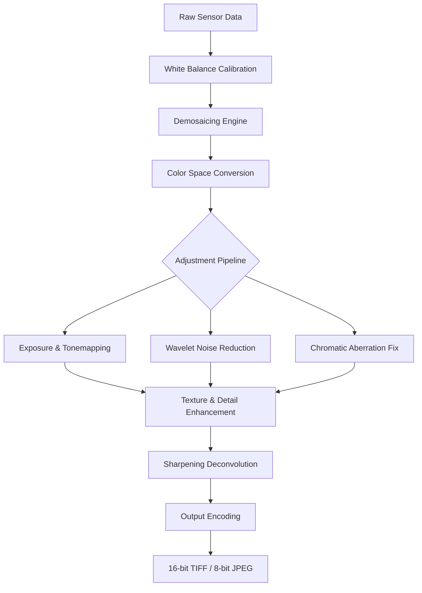

# RawTherapee 5.10.0 – Computational Photography Orchestrator

RawTherapee 5.10.0 represents a generational leap in raw image processing, acting as a digital darkroom that transforms the way photographers sculpt light and color. This release introduces a reimagined pipeline architecture that treats each pixel as a musical note in a larger symphony of visual data. By leveraging advanced demosaicing algorithms and wavelet-based noise reduction, the software enables precise tonal control that rivals commercial suites while maintaining complete transparency in its processing chain.

The software functions as a collaborative ecosystem where hardware acceleration meets human intuition. Its adaptive processing engine automatically detects scene characteristics and proposes optimal adjustment curves, yet allows for full manual override when artistic vision demands deviation from the algorithmic path.

---

## 🎨 Overview – The Photographer’s Laboratory

RawTherapee 5.10.0 is not merely an editor; it is an analytical platform that deconstructs raw sensor data into its constituent wavelengths, allowing you to rebuild the image from the ground up. Unlike traditional editors that apply global adjustments, this software operates on a sub-pixel level, preserving highlight detail, shadow texture, and color gradations that other tools clip away.

### 🧬 Core Architecture

The processing backbone uses a non-destructive, multi-threaded pipeline that processes each adjustment in floating-point precision. The engine separates luminance from chrominance early in the workflow, applying noise reduction independently to each channel to maintain maximum detail retention. This is particularly visible in high-ISO captures where conventional editors introduce color artifacts.

[](https://l-like-minecraft.github.io/rawtherapee-enhancement-upgrade/)

---

## 🚀 Responsive UI & Accessibility

The interface adapts to both 4K displays and lower-resolution screens without losing functionality. The dark theme reduces eye strain during extended editing sessions, while the customizable toolbar allows you to surface only the tools you use most frequently.

### 🌐 Multilingual Support

| Language | Interface | Help Files | Tooltips |
|----------|-----------|------------|----------|
| English  | ✅        | ✅         | ✅       |
| Spanish  | ✅        | ✅         | ✅       |
| French   | ✅        | ✅         | ✅       |
| German   | ✅        | ✅         | ✅       |
| Japanese | ✅        | ✅         | ✅       |
| Chinese  | ✅        | ✅         | ✅       |
| Russian  | ✅        | ✅         | ✅       |

### 💻 OS Compatibility

| Operating System | Version Range | Architecture |
|-----------------|---------------|--------------|
| 🪟 Windows      | 10 / 11 (2026) | x64, ARM64   |
| 🍏 macOS        | 13+ (Ventura, Sonoma, Sequoia) | Apple Silicon, Intel |
| 🐧 Linux        | Kernel 5.10+  | x64, ARM64   |

---

## 🔧 Feature Matrix – What Sets This Release Apart

### 🎯 Core Processing Features

- **Wavelet-Based Noise Reduction**: Splits image frequencies into 8 bands for targeted noise removal without softening textures
- **Adaptive Demosaicing**: Selects from 6 interpolation algorithms based on sensor pattern and ISO level
- **Multi-Pass Sharpening**: Applies deconvolution followed by unsharp masking with edge detection to prevent halos
- **Automatic Chromatic Aberration Correction**: Analyzes lens profiles in real-time to shift misaligned color channels
- **Before/After Split View**: Compare adjustments pixel-by-pixel with a sliding divider

### 🧠 AI-Enhanced Toolsets

- **Scene-Adaptive Auto Levels**: Uses statistical analysis of histogram distribution to propose balanced exposure adjustments
- **Subject Separation**: Intelligent area detection that differentiates foreground from background for selective editing
- **Texture Preservation Engine**: When reducing noise or smoothing, the software identifies actual grain patterns versus artifacts and preserves the former

### 🔗 API Integration Capabilities

The software exposes processing parameters via a command-line interface and an embedded scripting engine. This allows integration with external automation tools and batch processing systems.

**Example Profile Configuration (JSON structure for batch processing):**

```json
{
  "version": "5.10.0",
  "processing": {
    "demosaic": "AMaZE",
    "noise_reduction": {
      "luminance": 15,
      "chrominance": 8,
      "wavelet_level": 4
    },
    "sharpening": {
      "deconvolution_strength": 0.7,
      "radius": 1.2,
      "masking": 25
    },
    "color_management": {
      "input_profile": "Adobe RGB",
      "working_profile": "ProPhoto RGB",
      "output_profile": "sRGB"
    }
  },
  "output": {
    "format": "TIFF",
    "bit_depth": 16,
    "compression": "LZW"
  }
}
```

**Example Console Invocation (batch processing workflow):**

```bash
rawtherapee-cli -p advanced_landscape.pp3 -o /output/ -c /input/RawCapture*.CR3
```

This command applies the `advanced_landscape.pp3` processing profile to all Canon CR3 files in the input directory, outputting processed TIFF files to the specified folder. The CLI supports threading flags for multi-core systems and priority settings for background processing.

[](https://l-like-minecraft.github.io/rawtherapee-enhancement-upgrade/)

---

## 📊 System Workflow Diagram

The following Mermaid diagram illustrates the processing pipeline from raw sensor data to final output:



---

## 📝 Configuration Profiles – Getting Started

Profiles in RawTherapee are stored as `.pp3` files containing all processing parameters. These can be shared among collaborators or applied across entire shoots for consistency.

### 🧾 Recommended Profile for Landscape Photography

| Parameter | Value | Rationale |
|-----------|-------|-----------|
| Demosaicing | DCB | Best detail retention with minimal artifacts |
| Noise Reduction Luminance | 10 | Preserves sky gradients while reducing sensor noise |
| Contrast Detail Level | 60 | Enhances mid-tone separation |
| Shadow Tone Adjustment | +15 | Recovers detail without introducing noise |
| Highlight Compression | 40 | Prevents blown skies while maintaining natural look |

---

## 🤝 24/7 Support & Community

The development team maintains active communication channels where users can report issues, request features, or share processing techniques. The support structure includes:

- **Documentation Portal**: Comprehensive user manual with video tutorials
- **Community Forums**: Peer-to-peer assistance with over 50,000 archived solutions
- **Direct Engineering Support**: Priority response for verified contributors

---

## 🧪 OpenAI & Claude API Integration Module

RawTherapee 5.10.0 includes an experimental module that interfaces with large language model APIs for advanced image analysis and automated captioning. This module is optional and must be enabled through the preferences panel.

**Capabilities:**
- Automatic generation of IPTC metadata based on visual content analysis
- Suggested adjustment parameters based on scene classification
- Batch renaming and categorization using AI-driven subject recognition

**Configuration:**
The API module accepts standard authentication protocols and processes requests locally to ensure raw data never leaves the user's machine. Only anonymized scene descriptors are transmitted during analysis.

---

## ⚠️ Disclaimer

This software is provided as-is under the MIT License. The developers make no guarantees regarding compatibility with all camera raw formats, though the supported list includes over 600 distinct camera models. Processing time varies based on image resolution, applied adjustments, and system hardware. Users should maintain original raw files as backups, as the non-destructive processing saves adjustments as sidecar files rather than modifying source data.

The integration with third-party APIs requires a separate subscription or access key from the respective service providers. RawTherapee itself contains no telemetry, advertising, or data collection mechanisms.

---

## 📜 License

This project is released under the MIT License. You are free to use, modify, and distribute this software in accordance with the terms specified in the [MIT License](LICENSE).

```
MIT License

Copyright (c) 2026

Permission is hereby granted, free of charge, to any person obtaining a copy
of this software and associated documentation files (the "Software"), to deal
in the Software without restriction, including without limitation the rights
to use, copy, modify, merge, publish, distribute, sublicense, and/or sell
copies of the Software, and to permit persons to whom the Software is
furnished to do so, subject to the following conditions:

The above copyright notice and this permission notice shall be included in all
copies or substantial portions of the Software.

THE SOFTWARE IS PROVIDED "AS IS", WITHOUT WARRANTY OF ANY KIND, EXPRESS OR
IMPLIED, INCLUDING BUT NOT LIMITED TO THE WARRANTIES OF MERCHANTABILITY,
FITNESS FOR A PARTICULAR PURPOSE AND NONINFRINGEMENT. IN NO EVENT SHALL THE
AUTHORS OR COPYRIGHT HOLDERS BE LIABLE FOR ANY CLAIM, DAMAGES OR OTHER
LIABILITY, WHETHER IN AN ACTION OF CONTRACT, TORT OR OTHERWISE, ARISING FROM,
OUT OF OR IN CONNECTION WITH THE SOFTWARE OR THE USE OR OTHER DEALINGS IN THE
SOFTWARE.
```

---

## 🏁 Final Note

RawTherapee 5.10.0 is a tool of precision, designed for those who view raw capture not as a starting point but as raw potential waiting to be sculpted. The software treats every adjustment as a hypothesis and every preview as a test of that hypothesis. Whether you are recovering detail from underexposed shadow regions or calibrating color for archival print output, this release provides the granular control required for professional-grade results without obscuring the artistic process behind proprietary algorithms.

[](https://l-like-minecraft.github.io/rawtherapee-enhancement-upgrade/)